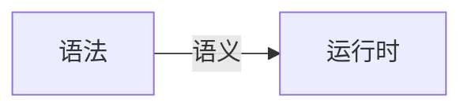

## 编程语言通识与JavaScript 语言设计

### 语言按语法分类

* 非形式语言
  * 中文、英文
* 形式语言(乔姆斯基谱系)
  * 0 型 - 无限制文法
  * 1 型 - 上下文相关文法（词放的位置不同，含义不同）
  * 2 型 - 上下文无关文法（词放的位置不影响含义，大部分的计算机语言都如此）
  * 3 型 - 正则文法（能用正则表达式解析的文法）

### 产生式（BNF） - 巴克斯诺儿范式

* 用尖括号括起来的名称来表示语法结构名
* 语法结构分成基础结果和需要用其他语法结构定义的复合结构
  * 基础结构称终结符
  * 复合结构称非终结符
* 引号和中间的字符表示终结符
* 可以有括号
* *表示重复多次
* |表示或
* +表示至少一次


示例：

假设有 2 个终结符，一个为 a，一个为 b，BNF 描述加法

```javascript
描述数字，十进制数
<Number> = "0" | "1" | "2" | .... | "9"
小数
<DecimalNumber> = "0" | (("1" | "2" | ... | "9") <Number>* )
描述加法
<Expression> = <DecimalNumber> "+" <DecimalNumber>
支持连加
<Expression> = <Expression> "+" <DecimalNumber>
单个数字 1 的写法支持
<Expression> = <DecimalNumber>
连加 & 单个数字 的写法
<AdditiveExpression> = <DecimalNumber> |  <Expression> "+" <DecimalNumber>

四则运算
<MultiplicativeExpression
```

> 随堂作业：编写支持 4 则运算的产生式

### 通过产生式理解乔姆斯基谱系

* 0 型 - 无限制文法

  ```javascript
  ?::=?
  ```

* 1 型 - 上下文相关文法

  ```javascript
  ?<A>?::=?<B>?
  ```

* 2 型 - 上下文无关文法

  ```java
  <A>::=
  ```

* 3 型 - 正则文法

  ```javascript
  <A>::=<A>?
  <A>::=?<A>
  ```

JavaScript 是以 2 型为主

> 尽可能寻找你知道的计算机语言，并尝试把他们分类。

### 图灵完备性

* 命令式-图灵机

  * goto 

  * if 和 while

* 声明式-lambda
  * 递归

### 动态与静态

* 动态
  * 在用户的设备/在线服务器上
  * 产品实际运行时
  * Runtime
* 静态
  * 在程序员的设备上
  * 产品开发时
  * Compile Time

### 类型系统

* 动态类型系统和静态类型系统
* 强类型与弱类型
  * String + Number
  * String === Boolean
* 复合类型
  * 结构体
  * 函数签名
* 子类型
  * 逆变/协变
  * 凡是能用 Array<Parent> 的地方，都能用 Array<Child>
  * 凡是能用 Function<Child> 的地方，都能用 Function<Parent>

### 一般命令式编程语言

* Atom
  * Identifier
  * Literal
* Expression
  * Atom
  * Operator
  * Punctuator
* Statement
  * Expression
  * Keyword
  * Punctuator
* Structure
  * Function
  * Class
  * Process
  * Namespace
* Program
  * Program
  * Module
  * Package
  * Library

### 重学 JavaScript




## JavaScript - 词法，类型

### Unicode 

Unicode 是一种字符集

* 标准说明网站：http://www.fileformat.info/info/unicode/

* 官方网站：https://home.unicode.org/

* 常用需要记住的编码

  * LINE FEED (U+000A) 换行符
  * FORM FEED (FF) (U+000C)

* CJK，Unicode 中文编码集合，字符个数 2 万多个

  https://www.fileformat.info/info/unicode/block/cjk_unified_ideographs/list.htm

* JS 中可以使用中文名当变量名，不建议使用中文名当变量，如果有硬性要求，使用转义后的 Unicode 编码当做变量

  ```javascript
  var \u5389\u5bb3 = 1;
  console.log(厉害);
  
  中文 unicode 编码获取，
  厉 ： "厉害".codePointAt(0).toString(16);  //5389
  害 ： "厉害".codePointAt(1).toString(16);  //5bb3
  ```

* Unicode Character Categories

  Unicode 会对字符进行一些分类，如大小写、数字等

  Separator，Space

#### InputElement

* WhiteSpace，空白(支持 Unicode 字符集的空白)

  * 5 种，除了 USP
  * 制表符特性，自动对齐，Tab，nbsp(no break space)，两个词之间使用 `&nbsp;` 隔开，不会被分词，也就是两个词会在同一行，不会被分割在两行。
  * ZWNBSP - 零宽空格(ZERO WIDTH NO-BREAK SPACE)

  * JavaScript 代码最佳实践，最好把代码字符限制在 ASCII 范围内，极限情况下，也不要超出 BMP 范围，超出会带来别的问题。

* Line Terminator，换行符

  LR，CR

* Comment，注释

  单行注释

  多行注释

* Token，词

  Identifier: 标示符

  Punctuator: 符号，括号，等号等等

  Literal: 直接量，true，null， undefined，128

  Keywords: if、for

  * 分类，程序结构上使用

    * Punctuator
    * Keywords

  * 实际编程时使用

    * Identifier

      * Keywords - 变量名
      * Identifier - 属性名

    * Literal

      * Number: Sign(1)， Exponent(11)， Fraction(52)，IEEE 754 Double Float 标准

      * Numer 进制表达，不需要使用 parseInt(xxx, 进制数)，可以使用直接量方式。八进制：0bxxxx

      * 判断浮点数操作是否相等，正确写法如下

        ```javascript
        // 浮点数的运算结果小于一定的精度，证明相等，并不存在绝对意义上的相等
        Math.abs(0.1 + 0.2 - 0.3) <= Number.EPSILON
        ```

      * String
        * ASCII
        * Unicode 
        * UCS U+0000 ~ U+FFFF
        * GB
          * GB2312
          * GBK(GB130000)
          * GB18030
        * ISO-8859
        * BIG5

    ### String - Grammar

    * 3 种形式

        ```javascript
"abc"、'abc'、`abc`
        ```

    * template 引擎解析过程
      * IdentifierName 实际分类形式
        * Keywords
        * Identifier
          * IdentifierStart 标识符
        * Future reserved Keywords: enum

​		

